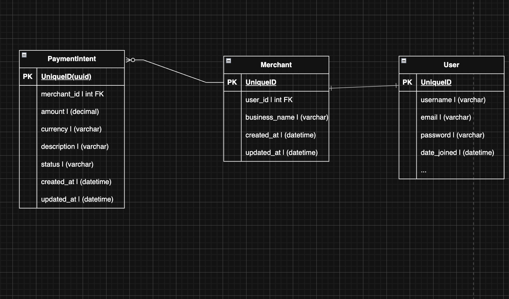

# Payment Service

A Simple Demo web app where Merchant can create payment links/ qr Code and Buyers can scan or visit the link and do the payment 
Please refer to .env and frontend/.env for configurations


## API Documentation


- Postman Dump:

  Collection -> [Download Postman Collection](docs/Pay.postman_collection.json)
  

---

## Requirements

- Docker
- Docker Compose

---

## Getting Started

1. **Clone the Repository**

   ```bash
   git clone https://github.com/jivesh-dot/vue.git
   cd 
   ```

2. **Environment Variables**

   - Check your local network IP using ifconfig, then update frontend/.env with it in the VITE_BASE_URL variable.

3. **Build and Start the Containers**

   ```bash
   docker-compose build --no-cache
   docker-compose up
   ```

3. **visit url in browser**
   ```bash
   ip(from step 2):port
   Eg: http://192.168.0.109:5173
   ```

---


1. **Check Running Containers**

   ```bash
   docker compose ps
   ```

   **Expected Output:**

   ```
   CONTAINER ID   IMAGE                          ...   PORTS                    NAMES
    NAME                IMAGE               COMMAND                  SERVICE             CREATED             STATUS              PORTS
    payments-api-1      payments-api        "bash -lc 'python ma…"   api                 42 minutes ago      Up 42 minutes       0.0.0.0:8000->8000/tcp
    payments-db-1       postgres:16         "docker-entrypoint.s…"   db                  2 hours ago         Up 42 minutes       0.0.0.0:5432->5432/tcp
    payments-web-1      payments-web        "docker-entrypoint.s…"   web                 42 minutes ago      Up 42 minutes       0.0.0.0:5173->5173/tcp
   ```

2. **Access the Application Container**

   ```bash
   docker compose exec api sh
   ```

---

